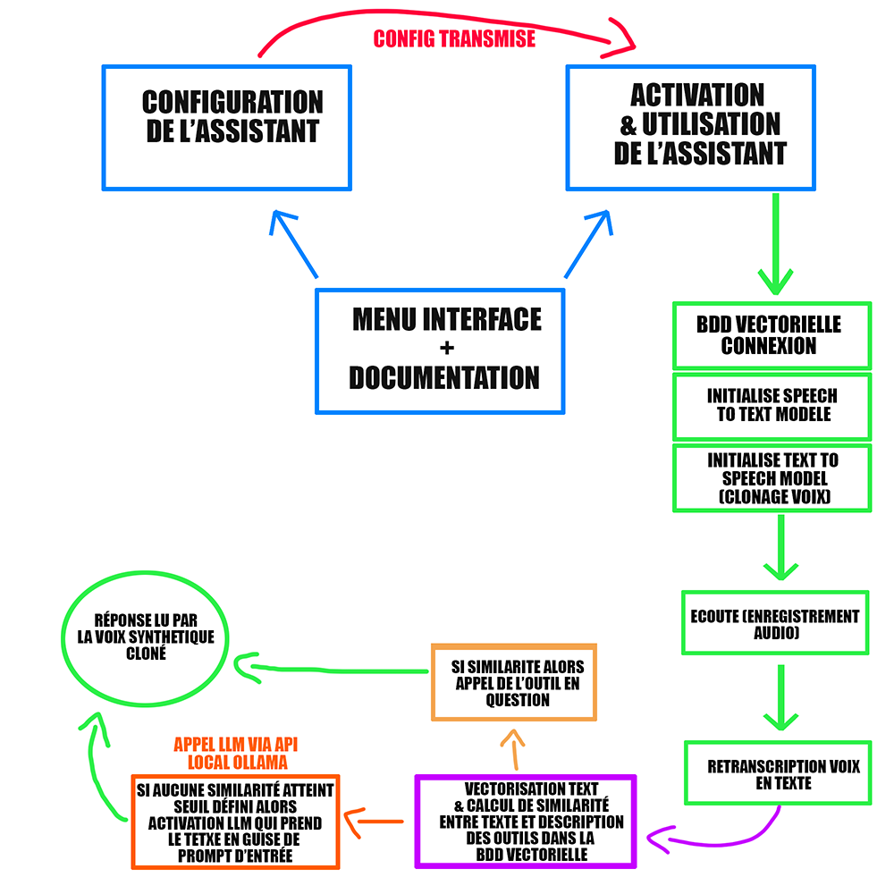

# Lux-Interface

Interface of Lux assistant which has a speech to text to transcribe your voice into text, a RAG system on tools to use tools according to the user's prompt and finally a voice cloning system allowing you to do text to speech on a customizable voice that you choose (or you can keep the voice that is already cloned and used by default in the kernel).


## Installation

=> Click on Lux-Interface-Installer.exe to download the app (be careful to install the necessary applications in Tech Stack).

=> Afterwards you click on lux-interface.exe to build environment for the app.


## Architecture System




## Tech Stack

[Application you have to install on your computer]

=> Download Ollama : https://ollama.com/download (version 0.5.4)

=> Download Python 3.11 (and add path to your os env variable) : https://www.python.org/downloads/release/python-3117/

=> Download CUDA 11.8 (check that your graphics card is compatible) : https://developer.nvidia.com/cuda-11-8-0-download-archive

*You may need to install (depends on your computer)*
- VS Community (with Dekstop packages) : https://visualstudio.microsoft.com/fr/visual-cpp-build-tools/

- scoop : ```powershell -Command "Set-ExecutionPolicy RemoteSigned -scope CurrentUser"``` & ```powershell -Command "iex (new-object net.webclient).downloadstring('https://get.scoop.sh')"```

- ffmpeg (put on path env variable) : ```scoop install ffmpeg``` and go on like C:\Users\your_user_name\scoop\apps\ffmpeg\your_version_of_ffmpeg\bin, copy the absolute path on the url on the top, open your environnement variables, go on 'PATH' in your user on your environnement variables and click on 'new' button and paste the url that you copied


## Narrator Voices

If you want to have more synthetic voices available, on Windows you have to go to the narrator settings and you can download the voices you want.

If this doesn't work and doesn't recognize the voices you have installed on the narrator settings, follow this steps :

- 1-/Open the Registry Editor by pressing the “Windows” and “R” keys simultaneously, then type “regedit” and press Enter.

- 2-/Navigate to the registry key : HKEY_LOCAL_MACHINE\SOFTWARE\Microsoft\Speech_OneCore\Voices\Tokens.

- 3-/Export this key to a REG file (with a right click on the file).

- 4-/Open this file with a text editor and replace all occurrences of HKEY_LOCAL_MACHINE\SOFTWARE\Microsoft\Speech_OneCore\Voices\Tokens with HKEY_LOCAL_MACHINE\SOFTWARE\Microsoft\SPEECH\Voices\Tokens.

- 5-/Save the modified file and double-click it to import the changes to the registry.


## Author

- [@nixiz0](https://github.com/nixiz0)
