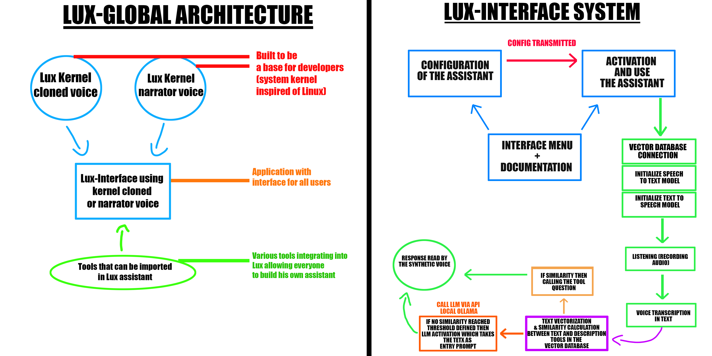

# Lux Project

Welcome to the **Lux Project**! This project aims to provide a powerful and flexible assistant for all users (using the version accessible to all who are Lux-Interface) but also for developers (using the Lux-Kernel versions here) allowing developers to use this as a basis to build whatever they want with.


## 🖥️ Lux Interface

The **Lux Interface** is designed for end-users who may not be developers. It provides a user-friendly interface to configure and personalize the assistant without using command lines.

The interface is user-friendly and allow to:
- Configure the system.
- Import different tools.
- Run the asssitant.


## 🛠️ Lux Kernel

The **Lux Kernel** is designed for developers and consists of two main components:

1. **Synthetic Cloned Voice Kernel**: A text-to-speech system using cloned synthetic voices (*requires high-performance hardware to use this system*), here we use *CoquiTTS*.
2. **Synthetic Narrator Voice Kernel**: A text-to-speech system using a windows narrator's voice.

The Lux Kernels also includes:
- **Speech-to-Text**: Convert spoken words into text, using *Whisper large v3*.
- **Intelligent Tool Selection System**: Using a RAG system to select tools based on user prompts, using *sklearn* for similarity & *ChromaDB* for vector database.
- **Inspired by Linux Kernel**: A flexible and small assistant core to allow developers to create various features with it and be able to use it as a base.


## 🚀 Installation

1. **Download the App**:
   - Click on `Lux-Interface-Installer.exe` to download the app.
   - Ensure to install the necessary applications in the *Tech Stack*.

2. **Build the Environment**:
   - Click on `lux-interface.exe` to build the environment for the app.


## 🏗️ System Architecture




## ⚙️ Tech Stack

### Applications You Need to Install

1. **[Ollama](https://ollama.com/download) (version 0.5.4)**
2. **[Python 3.11](https://www.python.org/downloads/release/python-3117/)** (add path to your OS environment variable)
3. **[CUDA 11.8](https://developer.nvidia.com/cuda-11-8-0-download-archive)** (ensure your graphics card is compatible)

### Additional Installations (if needed)

- **[VS Community](https://visualstudio.microsoft.com/fr/visual-cpp-build-tools/)** (with Desktop packages)
- **Scoop**:
  ```powershell
  powershell -Command "Set-ExecutionPolicy RemoteSigned -scope CurrentUser"
  powershell -Command "iex (new-object net.webclient).downloadstring('https://get.scoop.sh')"

- **FFmpeg**:
  ```powershell
  scoop install ffmpeg


## 🎙️ Windows Narrator Voices

To use Windows Narrator Voices instead of cloned voices, you can download more synthetic voices from the narrator settings.

If it doesn't recognize the voices you installed, follow these steps:

1. **Open the Registry Editor**:
   - Press the “Windows” and “R” keys simultaneously, type “regedit”, and press Enter.

2. **Navigate to the Registry Key**:
   - `HKEY_LOCAL_MACHINE\SOFTWARE\Microsoft\Speech_OneCore\Voices\Tokens`

3. **Export the Key to a REG File**:
   - Right-click on the key and select "Export".

4. **Edit the REG File**:
   - Open the REG file with a text editor.
   - Replace all occurrences of `HKEY_LOCAL_MACHINE\SOFTWARE\Microsoft\Speech_OneCore\Voices\Tokens` with `HKEY_LOCAL_MACHINE\SOFTWARE\Microsoft\SPEECH\Voices\Tokens`.

5. **Import the Modified REG File**:
   - Save the modified file and double-click it to import the changes to the registry.


## Author

- [@nixiz0](https://github.com/nixiz0)
